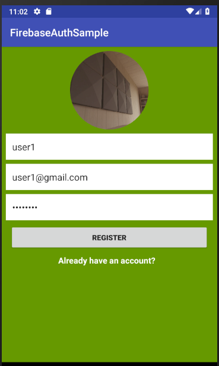

# FirebaseAuthSample

## 概要

Firebaseの認証を用いて、ユーザ登録・ログインを試すことが出来るサンプルアプリです。

## 使い方

### ユーザ登録

1. SELECT PHOTOボタンをクリックして好きな画像を選択
1. Userボックスに好きな名前を入力
1. Emailボックスに自分のメールアドレスを入力
1. Passwordボックスにパスワード(6文字以上)を入力
1. REGISTERボタンをクリック

"Registeration successful!"と画面下部に表示されれば登録は完了です。

### ログイン

1. "Already have an account?"をクリック
1. Emailボックスに自分が登録したメールアドレスを入力
1. Passwordボックスに自分が登録したパスワードを入力
1. LOGINボタンをクリック

"Successful Login!"と画面下部に表示されればログインは成功です。

### Firebase Authenticationによるユーザ登録の仕様

- Emailアドレスの形式に沿ってないもので登録しようとすると弾かれます(ex. "test"など)
- Passwordの長さは最低6文字以上無いと弾かれます(ex."1111"など)